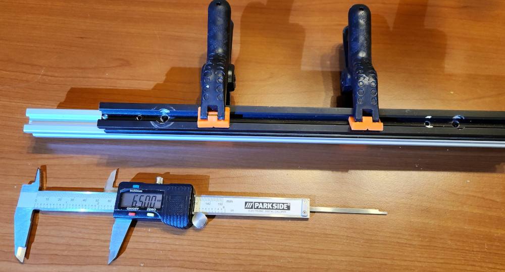
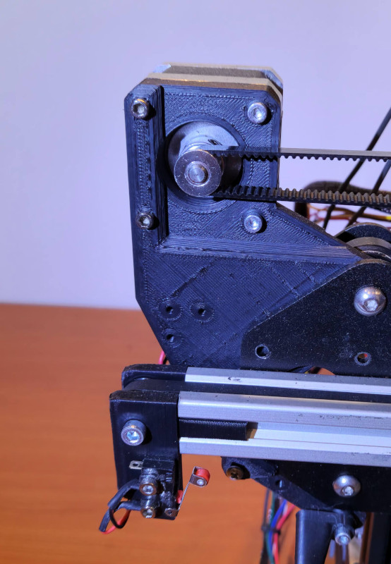
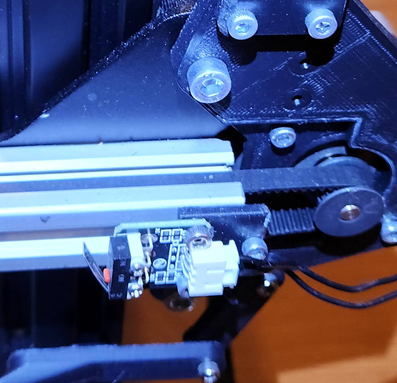
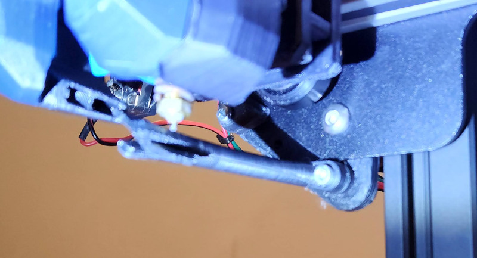
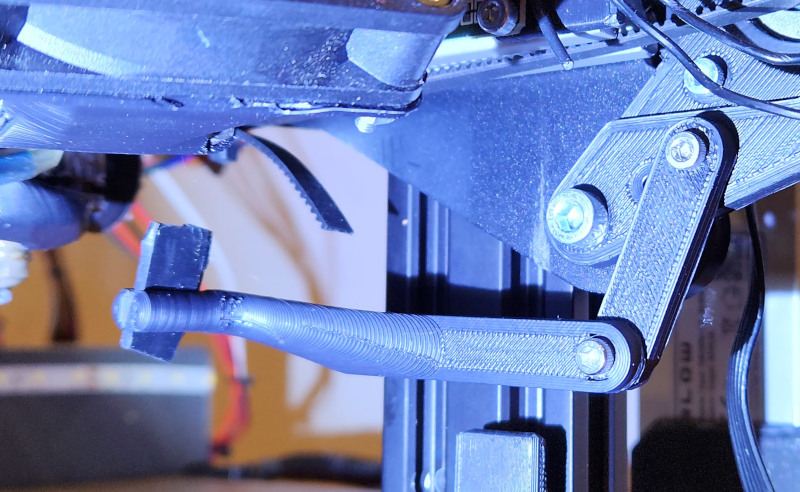
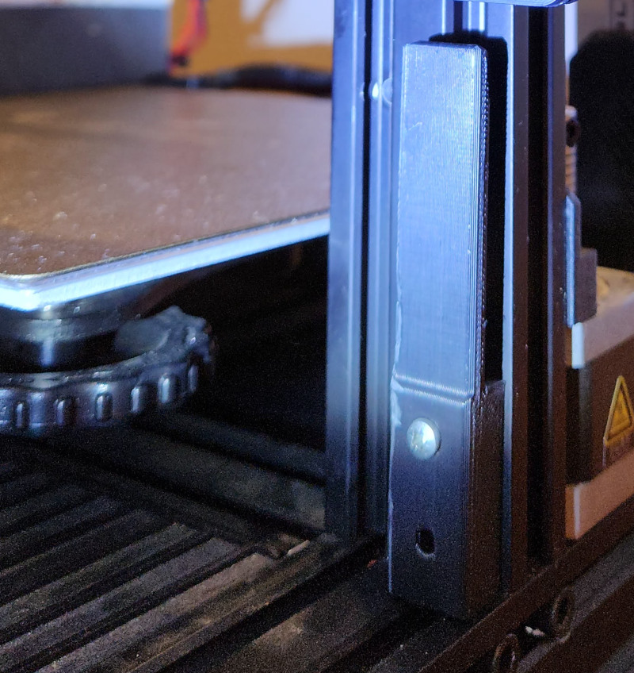

# Project "Endex3"
Ender 3 Idex conversion

Prototype:

Idex in action:
[Idex in action](media/idex-in-action.mp4)

## Would like to support?
If you like the project or find it useful, you may support it here:
* https://buymeacoffee.com/ernisv
* https://patreon.com/ernisv

## Goals

* fully functional Idex
  * multimaterial printing without excessive filament/print time waste
  * copy mode
  * mirror mode
* no loss of printable area for at least one of the heads
* ooze prevention for idle nozzle
* controlled by Klipper firmware
* footprint width not to exceed 50cm
* reuse of commodity 3d printing parts of Ender3 era

## Additional hardware 

* NEMA17 stepper motor for new toolhead
* GT2 6mm belt - about 90cm
* GT2 pulley for the motor
* GT2 idler
* microswitch for second X endstop
* 410mm 2020 extrusion for longer X gantry
* new toolhead - extruder with stepper, heating block, thermistor, hotend and part cooling fan
* Klipper compatible control board to control:
  * 2 stepper motors - additional X motor, additional extruder
  * control new toolhead's heater
  * control new toolhead's part cooling fans
  * monitor new toolhead's temperature
* additional power needs  
  * can be small additional 200W PSU that could power the heated bed
  * or complete 550W+ replacement for original PSU
  
## Conversion story
So before all that there was a Creality Ender3 V2, which was a first printer and during many years it morphed little by little to gain more speed, more flowrate, bed levelling, magnetic bed, Klipper.. and still was printing reliably enough to avoid being replaced by anothing more modern :)

But there was still a feature that it missed - multimaterial printing. And in 2025 - year when multimaterial became the norm with all multiplexing filament changers and even proper toolchangers coming, this became a matter of survival for the Ender3..

And the solution for that was one - Idex conversion. Idex is better than filament changers as produces less waste and switches materials much faster and even offers some interesting unique features that even proper toolchangers do not have - copy and mirror modes when single printer essentially is doing work for two :) 

So it started in CAD, trying to sqeeze additional axis belt, motors and toolhead while keeping bulky v-wheels system and most stock hardware.. 

After some time theoretically everything looked good in CAD.. did not work in practice though :)

First issues were random resets when bed heating and both toolheads were working simultaneously. 
In fact stock PSU now had to support 3 new stepper motors:
- dual X motor (one of previous mods), new extruder motor and new X motor,
- additional hotend heater,
- additional fans.
So it was solved by getting additional 200W 24V PSU and it taking care of powering heated bed, so that all the rest could stay on original PSU.

At this point and quite a bit of calibrations and tuning, this amazing print was produced by both toolheads collaboratively.

It looked like a success.. but bigger prints still failed after some time - printheads were clogging. Especially the original Ender3 hotend. 
It was already modified previously - all metal heatbreak and Volcano nozzle for bigger flowrate, it even had bigger 60mm hotend fan in place of stock 3010 to solve the previous issues with heat creep. 
And this worked for single toolhead prints, when there was constant flow of filament being pushed through.

However now, when it needed to sit idle for minutes between extrusions - old issues came back.. so in the end to complete Idex conversion, stock hotend had to be replaced.

Checking the drawers yielded V6 hotend and direct drive Titan extruder. None of existing public designs for direct drive with hardware i had at hand did fit due to contraints of additional X belt and second toolhead, so it ment one - back to the CAD again..

And it worked out, but produced this monstrocity. This is not a suggestion to use the same for anyone wanting to do similar conversion by any means :) 

And finally it was working, evidence below !

What looked like a quick, relatively straightforward mod, took way more than expected - but now it's finished and working. It's shared here as there are not a lot of public designs leveraging mostly stock parts.

Now let's dive into each individual component/change to be able to create more Endexes.

Also if your drawers have different components - adaptations and variations of this conversion could be gathered here, please raise a Pull Request with suggested changes.

## Details / component changes
Changes to individual components are broken down below. If unsure about dimensions / assembly - step files and/or original [Onshape CAD](https://cad.onshape.com/documents/81a2e00ae9c5806eab5e1c54/w/5cac38db4e9fa7317548eab6/e/0372a484cd82c8e6febd21dc?renderMode=0&uiState=692aace23f08f25fcdbc0587) could be checked.

### X gantry
#### Longer 2020 extrusion
As stock x axis has space only for original head, putting another one on the same would significantly reduce the bed area accessible by any single head, so extension of this is necessary.
This is likely the most mechanically difficult part of the conversion as it needs replacement of stock extrusion and drilling correct holes at the same places as in old one.

The length of new 200 v-slot extrusion should be 410mm (could be reduced to around 400mm, but endstop mount will have to be mounted in some more compact way).

It is important to ensure that the left end of new extrusion is protruding 65mm from the end of original one, then original extrusion could be fixed together with the new one and used as a guide for drilling pilot holes.
To doublecheck - distance from the new extrusion left end to the first hole center should be 66.4mm.

Note: it needs to be v-slot extrusion, not t-slot, cause t-slot is not designed for v-wheels.

Once pilot holes are drilled - you will need to complete the drilling and tap the threads in M3 holes.

You will need:
* 3mm drill bit,
* 5.5mm drill bit,
* M3 tap,
* 11mm drill bit or dremel to clear space for M5 bolt heads from one side.

#### Original X belt / motor
With longer extrusion, original X motor placement is no longer an option. But moving motor further to the left would not allow to fit into 50cm width footprint.
So original X motor had to go to the right side onto newly designed mount where previously was a x belt tensioner.
Belt still goes inside the extrusion like before.

### Additional X belt
Now when original X motor was relocated to the right side, to keep weights balanced - new X motor should go to left side on new mount plate.
The required new GT2 6mm belt length is about 90cm.

#### X endstops
Left endstop is a microswitch having 2 holes for M3 with 10mm distance between them.

Right one has a mount sliding into extrusion and bolting on original x endstop.

#### Ooze prevention
Idling heads will ooze some filament even if slicer reduces idle temperatures - they won't drop immediately. To help with that, X gantry includes ooze blockers, that cover the nozzles when heads are in idle park positions.

They are slightly adjustable, printed in ABS and are supposed to have clamped strips of high temp silicone for the immediate contact area with the nozzles. Simplest way is to take heatblock silicone socks and cut out strips from them.

#### Dual Z
It's not strictly necessary, but highly recommended as weight of x gantry has increased.
This conversion has no particular solution included, but there are lots of publicly available options for Ender3 v2 dual Z axis.

#### Gantry levelling
With increased X gantry weight there are more possibilities for it to get out of alignment. If dual Z solution uses belt-synchronized Z sides, it may be less relevant, but still useful.

This conversion has two blocks of equal size on which X extrusion could be rested until a touch (manually, with heads out of bed area in park positions).
Right block can be left attached permanently, but left one blocks X head movement when attached, so it is a clip-on to be attached only during alignment.

### 2nd toolhead
stealthburner
mechanical z adjustments
Volcano mod
nema17 pancake mod
V6 mod ??

### original toolhead
bltouch
suitable alternatives ?

### second board

### additional PSU

### Klipper configs

## Contributing mods / improvements
TBD

List of improvements needing work can be found in [TODO.txt](TODO.txt).
