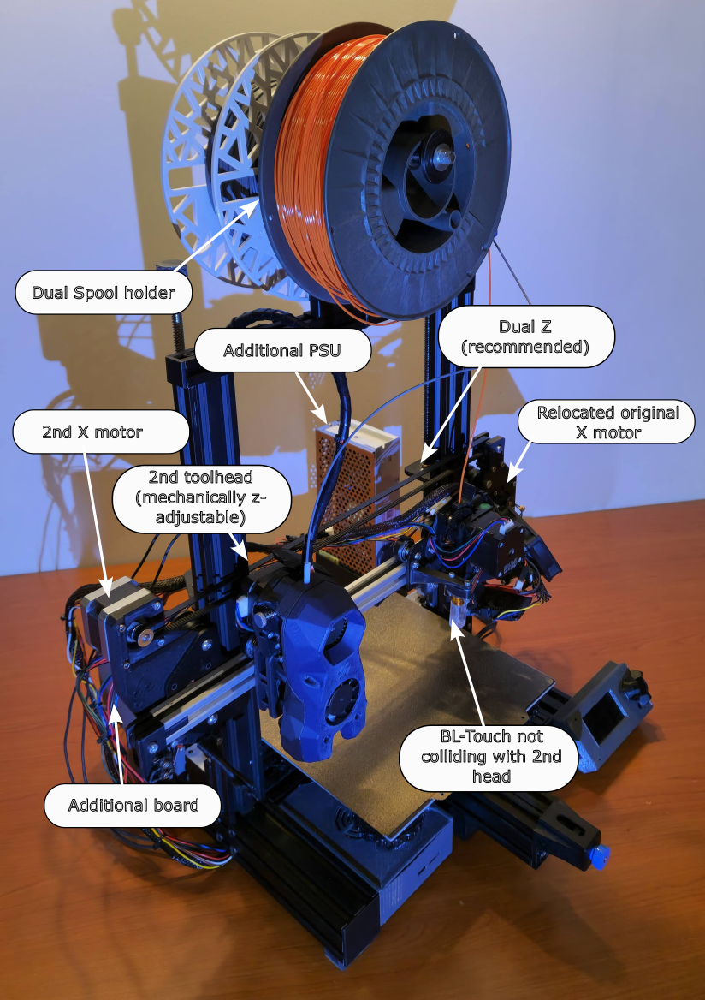
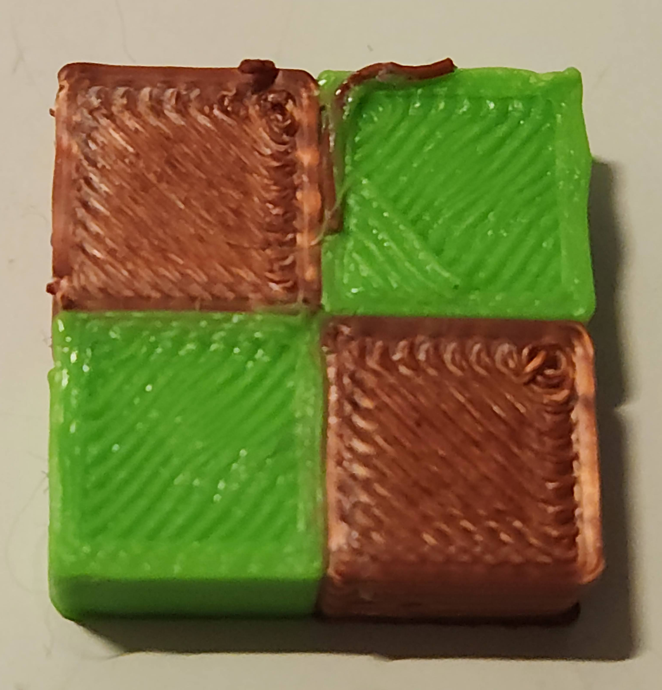
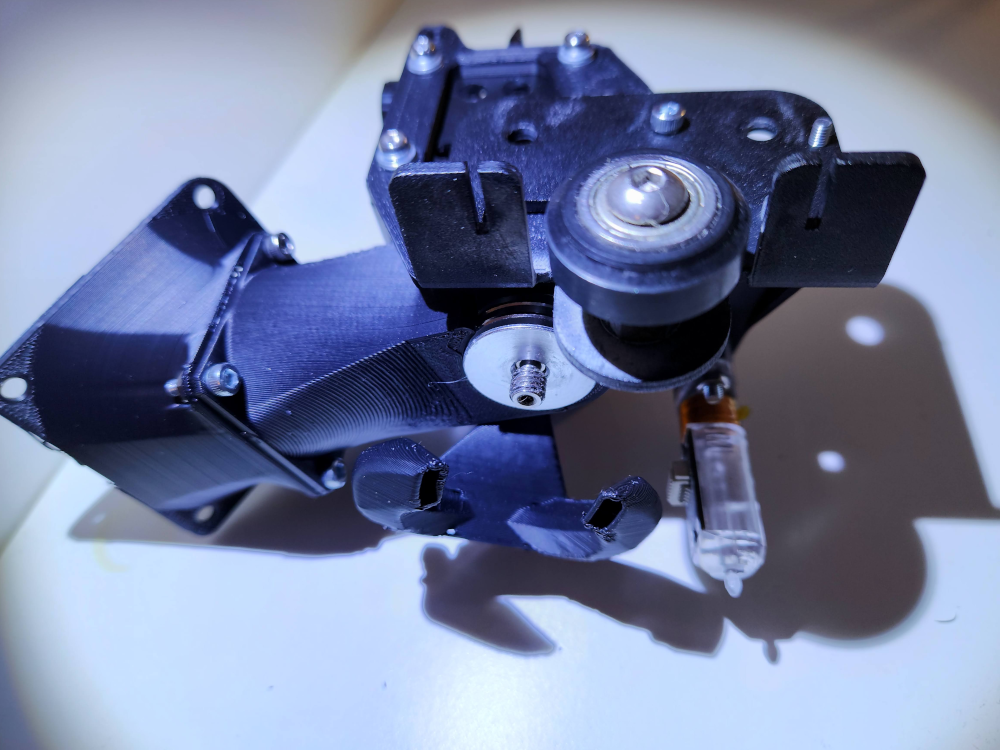
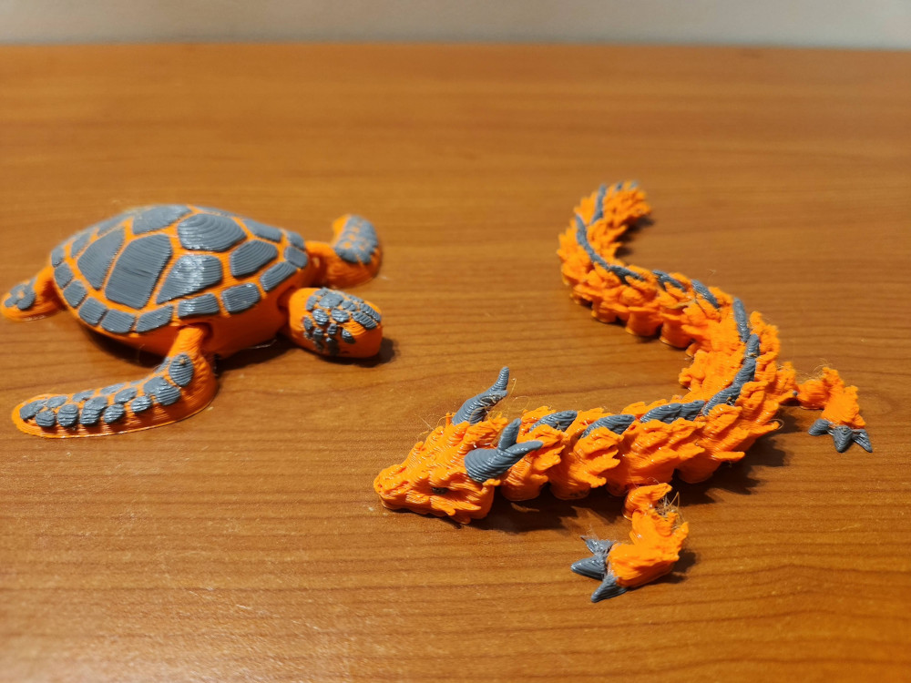

# Project "Endex3"
Ender 3 Idex conversion

Prototype:

Idex in action:
[Idex in action](media/idex-in-action.mp4)

## Support the project
TBD

## Goals

* fully functional Idex
  * multimaterial printing without excessive filament/print time waste
  * copy mode
  * mirror mode
* no loss of printable area for at least one of the heads
* ooze prevention for idle nozzle
* controlled by Klipper firmware
* footprint width not to exceed 50cm
* reuse of commodity 3d printing parts of Ender3 era

## Additional hardware 

* NEMA17 stepper motor for new toolhead
* GT2 6mm belt - about 90cm
* GT2 pulley for the motor
* GT2 idler
* microswitch for second X endstop
* 410mm 2020 extrusion for longer X gantry
* new toolhead - extruder with stepper, heating block, thermistor, hotend and part cooling fan
* Klipper compatible control board to control:
  * 2 stepper motors - additional X motor, additional extruder
  * control new toolhead's heater
  * control new toolhead's part cooling fans
  * monitor new toolhead's temperature
* additional power needs  
  * can be small additional 200W PSU that could power the heated bed
  * or complete 550W+ replacement for original PSU
  
## Conversion story
So before all that there was a Creality Ender3 V2, which was a first printer and during many years it morphed little by little to gain more speed, more flowrate, bed levelling, magnetic bed, Klipper.. and still was printing reliably enough to avoid being replaced by anothing more modern :)

But there was still a feature that it missed - multimaterial printing. And in 2025 - year when multimaterial became the norm with all multiplexing filament changers and even proper toolchangers coming, this became a matter of survival for the Ender3..

And the solution for that was one - Idex conversion. Idex is better than filament changers as produces less waste and switches materials much faster and even offers some interesting unique features that even proper toolchangers do not have - copy and mirror modes when single printer essentially is doing work for two :) 

So it started in CAD, trying to sqeeze additional axis belt, motors and toolhead while keeping bulky v-wheels system and most stock hardware.. 

After some time theoretically everything looked good in CAD.. did not work in practice though :)

First issues were random resets when bed heating and both toolheads were working simultaneously. 
In fact stock PSU now had to support 3 new stepper motors:
- dual X motor (one of previous mods), new extruder motor and new X motor,
- additional hotend heater,
- additional fans.
So it was solved by getting additional 200W 24V PSU and it taking care of powering heated bed, so that all the rest could stay on original PSU.

At this point and quite a bit of calibrations of tuning, this amazing print was produced by both toolheads collaboratively.

It looked like a success.. but bigger prints still failed after some time - printheads were clogging. Especially the original Ender3 hotend. It was already modified previously - all metal heatbreak and Volcano nozzle for bigger flowrate, it even had bigger 60mm hotend fan in place of stock 3010 to solve the previous issues with heat creep. And this worked for single toolhead prints, when there was constant flow of filament being pushed through.

However now, when it needed to sit idle for minutes between extrusions, old issues came back.. so in the end to complete Idex conversion, stock hotend had to be replaced.
Checking the drawers yielded V6 hotend and direct drive Titan extruder. None of public existing designs did not fit due to contraints of additional X belt and second toolhead, so it ment one - back to the CAD again..
And it worked out, but produced this monstrocity. This is not a suggestion to use the same for anyone wanting to do similar conversion by any means :) 

And finally it was working, evidence below !

What looked like a quick, relatively straightforward mod, took way more than expected, but now it's there. It's shared here as there are not a lot of public designs leveraging most stock parts.

Now let's dive into each individual component/change to be able to create more Endexes.

Also if your drawers have different components - adaptations and variations of this conversion could be gathered here, please raise a Pull Request with suggested changes.

## Details / component changes

### X gantry
2020 extrusion
old X belt / motor
additional X belt
ooze prevention
dual Z recommendation
gantry levelling

### 2nd toolhead
stealthburner
mechanical z adjustments
Volcano mod
nema17 pancake mod
V6 mod ??

### original toolhead
bltouch
suitable alternatives ?

### second board

### additional PSU

### Klipper configs

## Contributing mods / improvements
TBD
